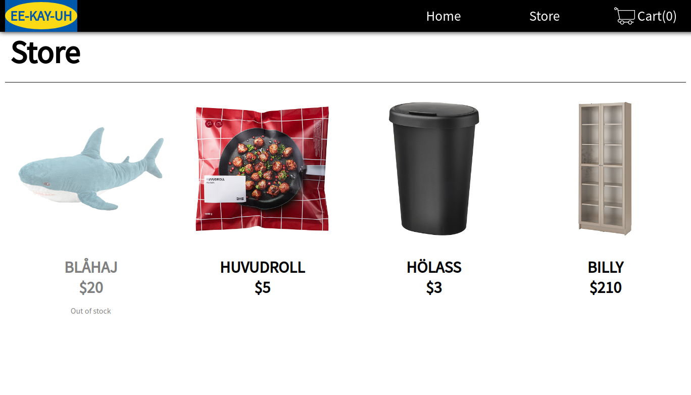
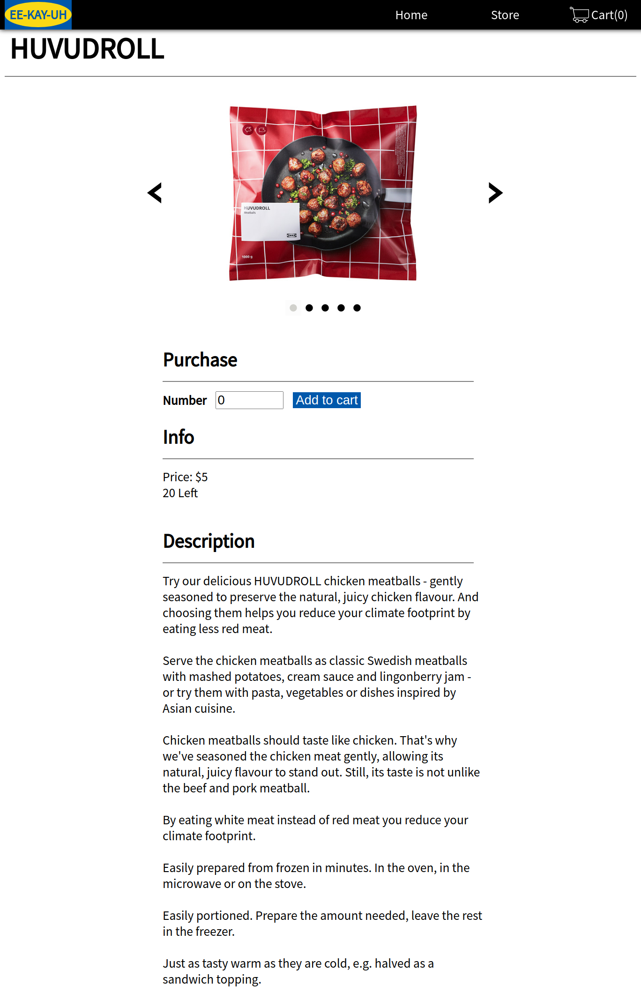

# shopping-cart
A shopping website that allows user to select products, put them into shopping carts, and checkout. 
The products and icons are mocks of IKEA.  
# Details
- Made with React.js
- Made with React.js Router
- Tested DOM with testing library
# Credit
- Home page background image by [Toa Heftiba](https://unsplash.com/@heftiba?utm_source=unsplash&utm_medium=referral&utm_content=creditCopyText) on [Unsplash](https://unsplash.com/s/photos/furniture?utm_source=unsplash&utm_medium=referral&utm_content=creditCopyText)
- Photos, names and description of products are from IKEA website
# Result
## Store Page

## Item Page

# Link
[Live Preview](https://ascodeasice.github.io/shopping-cart)